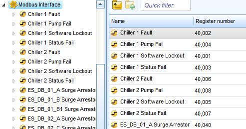
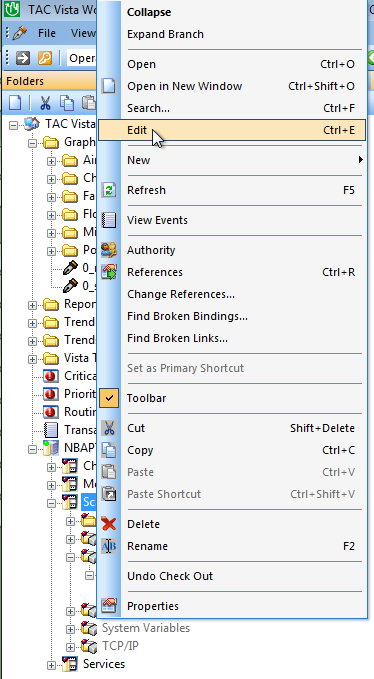
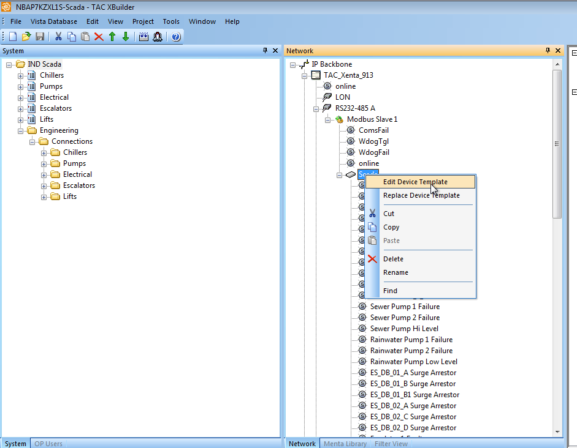

# Vista to SBO Conversion Tools

## Modbus slave transition
Converts Vista Modbus slave registers to SBO Modbus Interface registers.

### Directions:
1. In Vista Workstation, edit the Xenta Server hosting the Modbus Slave.

2. The XBuilder project opens. Navigate to the Modbus Slave object, Edit Device Template.

