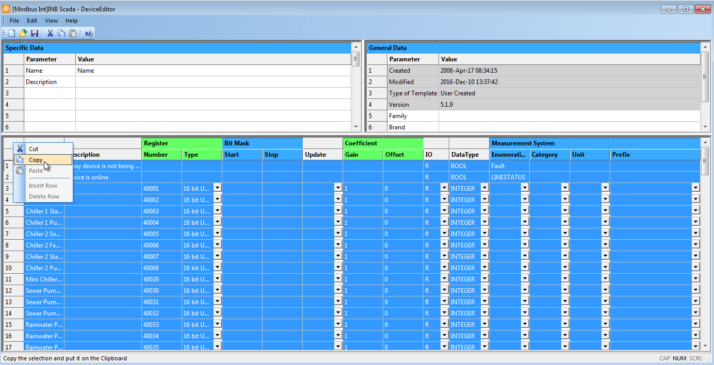
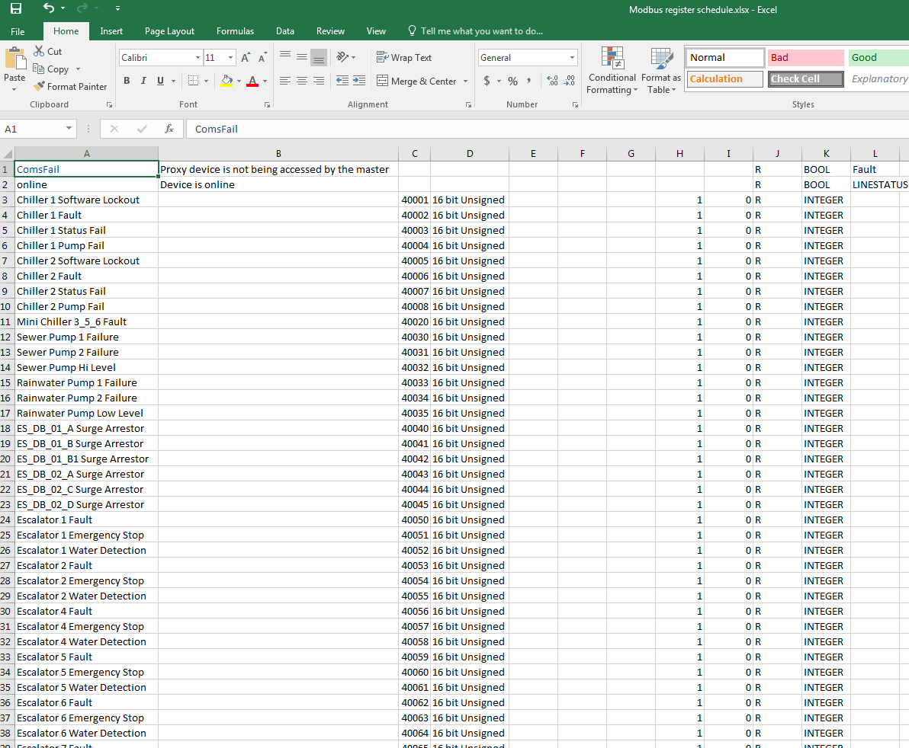

# Vista to SBO Conversion Tools

## Modbus slave transition
Converts Vista Modbus slave registers to SBO Modbus Interface registers.

NOTE: Currently only supports Digital Coil register types.


### Directions:
There are some manual steps that must first be taken in Vista.

- In Vista Workstation, edit the Xenta Server hosting the Modbus Slave.


- The XBuilder project opens. Navigate to the Modbus Slave object, Edit Device Template.


- The XBuilder Device Editor opens. In the data table, select the top-left cell to select all rows. Copy.



- In an Excel workbook, paste the data. For mulitple Modbus Slaves, repeat steps, pasting into a either a new sheet in the same workbook or append to the list in the same sheet.



- Save the workbook.

- Clone this repository. Example usage for generating the XML for importing into SBO is provided below.
```python
# This is a very long and ugly import call. I should probably clean it up one day
from SmartStruxure-engineering-toolkit.legacy_system.vista.modbus_slave_transition import ModbusSlaveTransition

# The Excel workbook you just created
my_xlfile = 'Example Modbus register schedule.xlsx'

# The XML filename you want to output to for importing into SBO
my_xmlfile = 'Example SBO Modbus registers output.xml'

# instantiate ModbusSlaveTransition object
sbo_modbus_converter = ModbusSlaveTransition(xlfile=my_xlfile, xmlfile=my_xmlfile)

# create SBO xml for importing
sbo_modbus_converter.make_xml()

```

- If successful, the XML file can be imported into a SmartStruxure Server.


